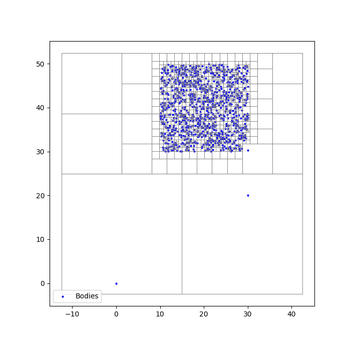
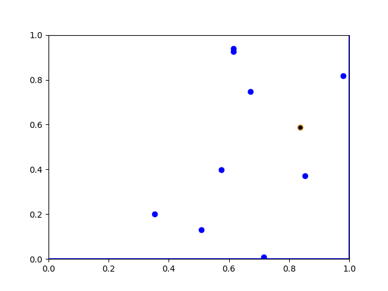
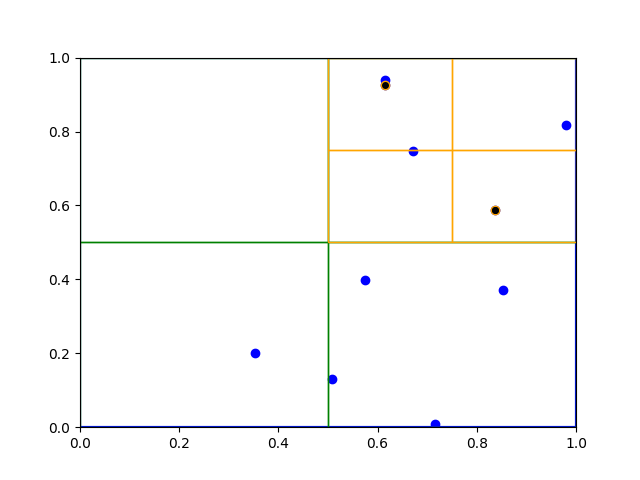
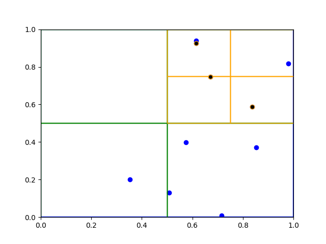
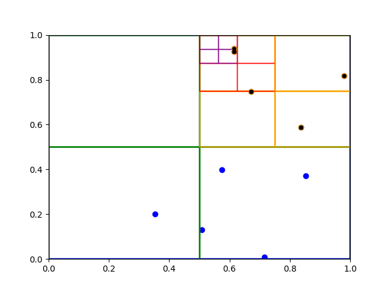
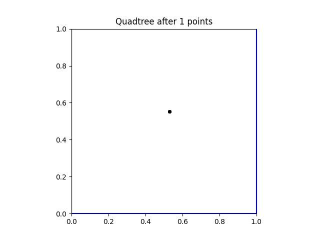

*This post is aimed at undergraduate students in mathematics, computer science, or physics. Since Barnes–Hut simulation uses ideas from all three 
of these fields, I hope that this illustrates the close connections between all three disciplines.*

In preparation for a (near) future blog post, I stumbled upon the idea of **Barnes–Hut simulation**. This simulation technique approximates the solution of an **n-body problem** with \(\mathcal{O}(n \log n)\) complexity, where the naïve brute-force method is \(\mathcal{O}(n^2)\). This post is concerned with the theoretical and computational aspects of approximating n-body problems through the lens of Newtonian gravity, providing the basis for simple gravitational simulations.

Here is a brief outline of the post. We start by discussing the formulation of n-body problems, briefly establishing connections with Hamiltonian mechanics. Then we discuss Størmer–Verlet methods, which provide a basis for approximating solutions of n-body problems. This motivates **quadtrees**, an efficient data structure to decompose space, which allows efficient approximations of the acceleration matrix. Afterwards we set up the Barnes–Hut algorithm, and finish with a few example implementations.

Although Barnes–Hut simulations are not without their problems, they offer a strong connection between ODEs, physics, and computation that is underappreciated in undergraduate education. In future blog posts I will use these simulations to motivate other numerical schemes, and as a playground to experiment with SINDy methods and PINNs. Anyhow, let's get into it!

||
|:--:|
|The initial particle positions for a Barnes-Hut simulation with a quadtree.|

## n-body Problems

Barnes–Hut simulation is an efficient way to approximate the solution of **n-body problems**, which model a system of point particles interacting with pairwise forces. These problems appear in a variety of fields, such as electrostatics or protein dynamics. This post focuses on **orbital mechanics**, the study of celestial objects interacting via Newtonian gravity.

Setting notation, let \(x(t) = (x_1(t), \ldots, x_n(t))^T\) be a vector of \(n\) point particles in \(\mathbb{R}^2\). Let \(A(x(t))=A(x)\) denote the **acceleration vector**, which contains the acceleration of each particle \(x_i\) at time \(t\), and let \(\ddot{x}(t) = (\ddot{x}_1(t), \ldots , \ddot{x}_n(t))^T\). By definition,

\[
\ddot{x}(t) = A(x(t)).
\]

Suppose that \(m = (m_1, \ldots, m_n)\) is the **mass vector** for \(x(t)\), and let \(M\) be the corresponding diagonal mass matrix. By **Newton’s second law**, we have that

\[
F(x(t)) = M A(x(t)) = M \ddot x(t).
\]
where \(F(x(t))\) is the vector of forces on \(x(t)\). For a sanity check, note that when \(n=1\), this becomes Newton's second law of motion for a single mass.

The notation \(x=x(t)\) is often used in numerical analysis to represent the motion of point particles, and can be seen in a variety of approximation algorithms. Physicists often use a different notation from **Hamiltonian mechanics**, which presents a clean framework to view \(n\)-body problems. Following this framework, let  \(q_1, q_2, \ldots q_n\) denote the positions of particles for an \(n\)-body system, and suppose that \(p_1, \ldots, p_n\) represent their momenta. By definition, one has that
\[
p_i = m_i \frac{dq_i}{dt}.
\]

Let

\[
\mathcal{T} = \sum_{i=1}^n \frac{\|p_i\|^2}{2m_i}
\]

denote the **total kinetic energy** of the system. If \(\mathcal{U}\) is the **scalar potential energy** of the system, then the **Hamiltonian** is

\[
\mathcal{H} = \mathcal{T} + \mathcal{U}.
\]

Using the Hamiltonian, one can find the equations of motion for a particle system. These are **Hamilton’s equations**, given by

\[
\frac{dq_i}{dt} = \frac{\partial \mathcal{H}}{\partial p_i}, \qquad  
\frac{dp_i}{dt} = -\frac{\partial \mathcal{H}}{\partial q_i}.
\]

Provided that the potential energy of a system is well behaved, one can apply existence and uniqueness results from ODE theory to guarantee the equations of motion have a unique solution. This does not mean that one can find it explicitly --- most of the time this is impossible, and a numerical solution is required. Moreover, the chaotic nature of such solutions has led to the development of multiple areas in mathematics and physics. 

To make these ideas concrete, consider a celestial system of particle masses which do not collide. By **Newton's Law of Gravitation**, 
\[F_{ij} = \frac{m_i m_j G}{||q_i-q_j||^2} \frac{(q_i-q_j)}{||q_i-q_j||},\]
where \(F_{ij}\) is the gravitational force of particle \(q_j\) acting on particle \(q_i\). Summing over all forces acting on \(q_i\), one finds that
\[F_i = m_i \frac{d^2 q_i}{dt^2} = \sum_{j \neq i}^n F_{ij} = \sum_{j \neq i}^n \frac{m_i m_j G}{||q_i-q_j||^2} \frac{(q_i-q_j)}{||q_i-q_j||}.\]

This is enough to approximate solutions to the system, and it can be directly related to Hamiltonian mechanics. Define the **potential energy** \(\mathcal{U}_i\) of \(q_i\) by
\[ \mathcal{U}_i = -\sum_{j\neq i}^n \frac{ m_i m_j G}{||q_i-q_j||}\]
and notice that, differentiating with respect to $q_i$ yields
\[ F_i = - \frac{\partial \mathcal{U}_i}{\partial q_i}.\]

The **potential energy** of the full system is given by 
\[\mathcal{U} = - \sum_{1\leq i < j \leq n} \frac{ m_i m_j G}{||q_i-q_j||},\]
and the full Hamiltonian is given by
\[\mathcal{H} = - \sum_{1\leq i < j \leq n} \frac{ m_i m_j G}{||q_i-q_j||} + \sum_{i=1}^n \frac{||p_i||^2}{2m_i}.\] 

Hence, solving Hamilton's equations will give the motion of the full system. This is equivalent to the system generated by Newton's second law, so one might wonder why we should care about this formulation in the first place. Most directly, it easier to see that this system has a solution, and we can directly apply standard approximation methods to find it's solution. In a more subtle direction, there is a far deeper theory surrounding Hamiltonian mechanics than Newtonian mechanics, which can highlight nuanced problems in numerical simulations. This perspective shows that Euler's method is undesirable for \(n\)-body simulation from both an efficiency standpoint and an accuracy standpoint. Luckily, the numerical methods explored in the next section are better in both regards. An example of such a simulation is shown below.

||
|:--:|
|An example $n$-body gravitational simulation.|

## Størmer–Verlet Methods

Størmer-Verlet methods are a set of algorithms used to approximate the solution to a Hamiltonian system of ODEs generated by an $n$-body problem. There are a number or reasons why they are preferable to Euler's method or a standard Runge-Kutta scheme --- they are inherently second order, cheap, and symplectic, meaning they preserve (at least approximately) the Hamiltonian of a system. Thanks to these properties, Størmer-Verlet methods are used in a variety of molecular and galactic simulations. 

Taking a matrix-vector formulation of the problem, suppose that \(\ddot{x}(t) = (\ddot{x}_1(t), \ldots , \ddot{x}_n(t))^T\), where \(M\) is a diagonal matrix containing the masses of the system, and \(F(x(t))\) is the vector of forces on \(x(t)\). Note that in this case and before, each coordinate of \(x(t)\) is a point in \(\mathbb{R}^2\), so \(x_i(t)= (x_i^1(t),x_i^2(t)) \in \mathbb{R}^2\) for all \(i=1, \ldots , n\) and \(x(t) \in \mathbb{R}^{n \times 2}\). As in the previous section, the second order system of ODEs governing the motion of the system are given by
\[M \ddot{x}(t) = F(x(t)) = - \nabla \mathcal{U}(x(t)),\]
which can be transformed into the system of second order equations
\[\ddot{x}(t) = A(x(t)).\]
The basic Størmer-Verlet scheme is quite simple --- one expands the matrix equation in a Taylor series, and then truncates after the second term. Using the initial conditions \(x(t_0) = \bm x_0\) and \(\dot{x}(t_0)= \bm v_0\) for position and velocity, and setting \(t_n = t_0+n \Delta t\) for a fixed time step \(\Delta t > 0\), the method first sets
\[\bm{x_1} = \bm{x_0} + \bm{v_0} \Delta t + \frac{1}{2}A(\bm{x_0})  \Delta t ^2\]
and then iterates
\[\bm{x_{n+1}} = 2\bm{x_n} - \bm{x_{n-1}} + A(\bm{x_n})\Delta t ^2.\]
The discretization error for this method is better than the error for a Taylor series approximation. Since
\[x(t+\Delta t ) = x(t) +v(t) \Delta t + \frac{a(t) \Delta t^2}{2}+ \frac{b(t) \Delta t^3}{6}+\mathcal{O}(\Delta t^4)\]
and symmetrically
\[x(t-\Delta t ) = x(t) -v(t) \Delta t + \frac{a(t) \Delta t^2}{2}- \frac{b(t) \Delta t^3}{6}+\mathcal{O}(\Delta t^4),\]
adding these two equations together yields
\[x(t+\Delta t) = \overbrace{2x(t)+A(x(t)) \Delta t^2}^{\text{St{\o}rmer-Verlet}} +\underbrace{\mathcal{O}(\Delta t^4)}_{\text{error term}} .\]
The error term in this equation is an order more accurate than a direct Taylor series approach. A related approximation scheme of the same complexity is the \textit{velocity Verlet method}. This method is preferable for simulating Hamiltonian systems because it does a good job preserving the energy of the system, with the energy of the approximation oscillating about the constant energy of the conserved system. 

Our implementation of the velocity Verlet method relies on fractional time stepping. Suppose that $\bm{v}_n$ is known. Then $\bm{v_{n+\frac{1}{2}}}$ will be given by
\[ \bm{v_{n+\frac{1}{2}}} = \bm{v_n} +\frac{1}{2}A(\bm{x_n}) \Delta t.\]
As opposed to the presence of $\frac{1}{2}A(x(t))$ term in the Taylor expansion of $x(t)$, the $\frac{1}{2}A(\bm{x_n})$ term in this expression is due to the fact that we are propagating half a time step. The next step is a position update step, and is given by
\[\bm{x_{n+1}} = \bm{x_n} + \bm{v_{n+\frac{1}{2}}} \Delta t .\]
To finish the iteration, the velocity needs to be updated one more time
\[\bm{v_{n+1}} = \bm{v_{n+\frac{1}{2}}} +\frac{1}{2}A(\bm{x_{n+1}}) \Delta t .\]

It is hopefully apparent that the computational bottleneck for these simulations is calculating $A(\bm{x_n})$. For a celestial system, $A$ is an $n \times n$ symmetric matrix, it would take $(n+1)n/2$ evaluations to naively calculate the forcing. This is prohibitive for large $n$, and luckily, we can do better. By implementing an approximation method based on \textit{quadtrees}, the complexity of this evaluation goes from $\mathcal{O}(n^2)$ to $\mathcal{O}(n \log n)$. This is a drastic improvement --- for a simulation with $10^5$ bodies (which can easily appear in practice), a quadtree method is nearly one thousand times faster than a naive implementation!

---

## Quadtrees

|![A full quadtree in \([0,1]\times[0,1]\).](featured.jpg)|
|:--:|
|A full quadtree in $[0,1]\times [0,1]$.|

A **quadtree** is a tree data structure used to organize points and spatial data in two dimensions. By clustering particles into different quadtree nodes and calculating their mass / center of mass, force calculation can be approximated in $\mathcal{O}(n\log n )$ steps. This is the main idea behind in the Barnes-Hut algorithm, and is the driving force behind its applicability. 

The top of a quadtree is a single **root node** representing an entire rectangular domain, such as the unit square $[0,1] \times [0,1]$. This node will contain every particle in the system, such as the random points show above. The maximum number of points which can be contained in any given  node before subdivision is called the **capacity** of a quadtree.

We use a generic example to show how quadtrees are constructed. Start with the the points $x_1,x_2, \ldots x_{10} \in [0,1] \times [0,1]$. Selecting the first point $x_1$, shown below in **(a)**, nothing really happens --- $x_1$ is the only point that is in the tree, and belonging to the root node. When the point $x_2$ is added to the tree, the root node will now contain to points, so it must divide into four children. In this example, both of the points are contained in the top right quadrant, so the tree divides once more until they are both in separate leaf nodes. 

| ||
|:--:|:--:|
| **(a)** Root of the quadtree with a point. | **(b)** Second iteration of the quadtree after adding another point. |

This process repeats itself. Going through the list of points, a point is retained in a **leaf node** as long as it is the only point in the leaf node. If another point is added the node splits into four others, and the process repeats until all points are contained in separate lead nodes of the quadtree. Importantly, adding a point may not create a new division. As seen below in **(c)**, adding $x_3$ to the quadtree does not increase the node count, as $x_3$ is contained in a preexisting leaf with no other point. Since $x_4$ is not, another node in the quadtree divides, as seen in below in **(d)**. The full quadtree for this set of points is here at the top of this section.

| ||
|:--:|:--:|
| **(c)** Adding $x_3$ to the tree. | **(d)** Adding $x_4$ to the quadtree. |

For our simulations, nodes in the quadtree will need to keep track of their own total mass and **center of mass**, which will be used for the Barnes-Hut force approximation. Both of these tasks can be done directly in the creation of a quadtree. The mass update is simple (just add the extra mass). For the center of mass update, let $C$ be the center of mass for a node of mass $M$, and suppose we want to add a particle of mass $m$ to the node located at $c$. Then, the updated center of mass for the node will be given by
\[\frac{m c + M C}{m + M},\]
following the basic center of mass formula.

||
|:--:|
|Building a quadtree of capacity 2.|

## Barnes-Hut Simulation
With all the prerequisites covered, we are now ready to discuss the Barnes-Hut algorithm. Given a vector function $A$ representing the acceleration of a $n$-body system, we wish to approximate the solution to
\[\ddot x (t) = A(x(t)).\]
To do so, we will use Størmer-Verlet approximation, which relies on quick (and accurate) approximation of the function $A$. For a gravitational system, we need to estimate the force
\[F_i = \sum_{j\neq i}^n \frac{m_i m_jG}{||q_i-q_j||^2} \frac{q_i-q_j}{||q_i-q_j||},\]
which (after dividing by $m_i$) will govern the motion of particle $i$ in the system. To calculate this exactly, one would need to calculate the force of each particle on each other, taking $\mathcal{O}(n^2)$ steps. However, what happens when we calculate the gravitational force using the center of mass of a node, instead of single points? Although a star will change the orbit of a solar system, it won't have a huge impact on the evolution of a distant galaxy. This idea is formalized in the Barnes-Hut algorithm, which ultimately achieves a complexity of $\mathcal{O}(n \log n)$ per force evaluation.

Let's get into the details about how this actually works. Start by setting $\theta >0$, which is called the **opening angle** for the approximation. Suppose we want to approximate the force acting on particle $x_i$. We need to determine which nodes are used in the force approximation, starting with the root node. Since $x_i$ (and every other point) is contained in the root node, we will not use that node in the approximation and go into its children. For each non-leaf child containing a point other than $x_i$, calculate it's width $s$ and the distance $d$ between it's center of mass and $x_i$. If $ s/d < \theta$, then we will use this node in the force approximation. If not, we split the node and repeat this process until all nodes are visited. Finally, whenever leaf node is reached that contains a point, just apply the gravitational force attributed to that point to the force calculation.  

There are two aspects of this approximation which are worth highlighting. First, the choice of $s$ and $d$ make sense in the Barnes-Hut criterion. If the center of mass of a node is far away $d$ will be large, and it will have less impact on the approximation. Moreover, nodes with smaller width $s$ are better approximated using their center of mass, so checking whether $s/d < \theta$ is a sensible criterion for node approximation. Second, the reason why this approximation is $\mathcal{O}(n\log n)$ is because, for a suitably chosen $\theta$, one should only need to check $\mathcal{O}(\log n)$ nodes per force approximation. Assuming that points are relatively well equidistributed at all scales, the exponential decrease in width of the quadnodes is what underlies this complexity.

## Examples
Now that we have covered a bit of the theory behind Barnes-Hut approximation, let's see it in action. Each of the following simulations we created in C++ using either a basic Størmer-Verlet method or a velocity Verlet method. For each of them, the red particles are massive compared to the blue ones --- each red point has mass $10^4$, and each blue point has a mass randomly chosen in $[0.1,1]$. 

Now, let's look at the first simulation. There are a few things to notice. Each of the red particles start with a small initial velocity, it seems like some vortices form throughout the simulation. This is related to **kinetic theory**, which is a facinating field of mathematics too complicated for this blog post.
||
|:--:|
|Størmer-Verlet approximation with a disk.|

Another thing to notice is that, at the beginning of the simulation, some points shoot off with a high velocity. This is due to the fact that whenever points get very close to each other they experience a huge force, propelling them away at a high velocity. Although this is impossible to fix with non-colliding particles, adding collisions or changing to a different forcing could rectify this issue. What is more interesting (at least in my opintion) is how the simulation changes with different initial conditions. For example, if the small particles start in annulus, the dynamics are radically different.
||
|:--:|
|Velocity-Verlet approximation with an annulus.|

Finally, I would like to mention that this program can work with many different initial conditions, including the domain of my website!

Thank you for reading! The GitHub repository is [here](https://github.com/erikwendtmath/Galaxy-Simulation).