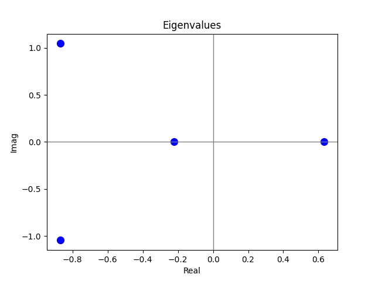
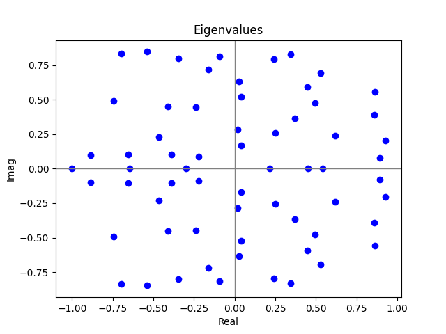
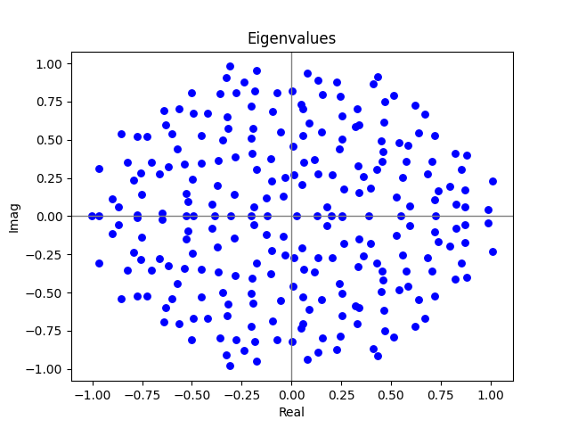
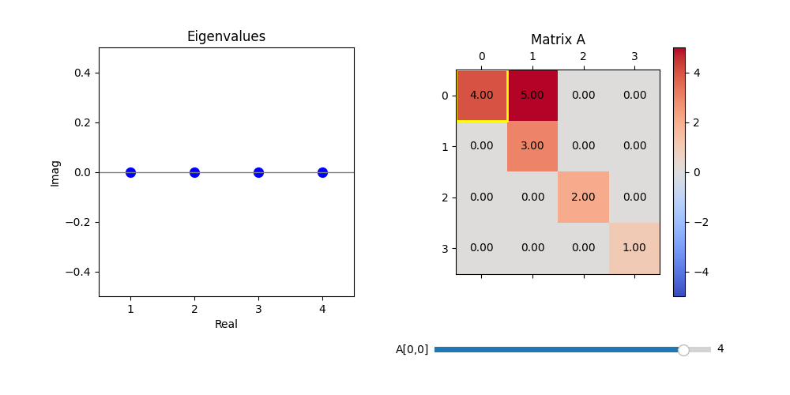
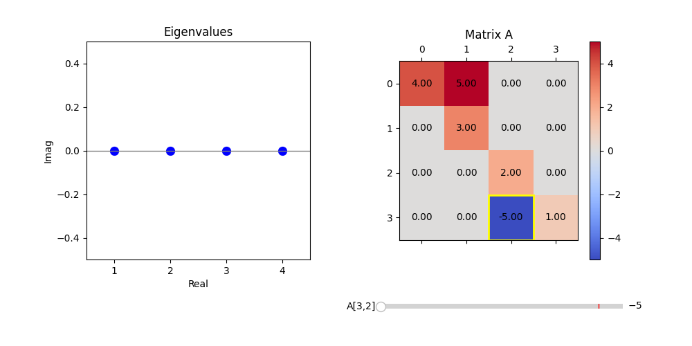
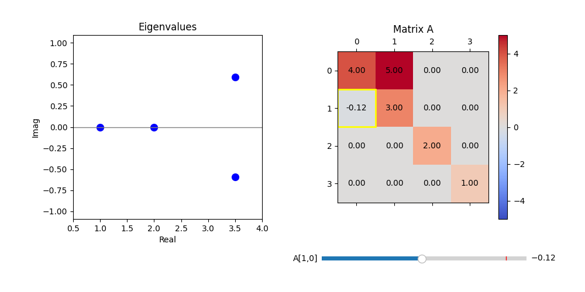

# Visualizing Eigenvalues

This blog post covers an eigenvalue visualizer I created to teach linear algebra.  
The goal of the visualizer is to give an interactive program that shows variations in eigenvalues based on matrix perturbations.  
In addition, this program can be used for basic eigenvalue plots, leading to introductory examples from random matrix theory.

---

## Limitations

Before diving in, we review the limitations of this program. It uses `numpy`'s built-in eigenvalue estimation algorithm, so it will be slower than an optimized solution.  
Moreover, any issues regarding the convergence or stability of `numpy`'s eigenvalue algorithm will be present in this program — although these will likely be the same for any standard eigenvalue algorithm.  

Additionally, the grid view (which shows a changeable matrix to the right of its spectrum plot) only works with real-valued matrices.  
Thanks to the use of a slider, all elements of a perturbed matrix are necessarily in the interval $[-5, 5]$.

|  |  |
|:--:|:--:|
| **(a)** Eigenvalues of a random $4 \times 4$ matrix. | **(b)** Eigenvalues of a $64 \times 64$ matrix. |

---

## What Are Eigenvalues?

As a refresher (and in case somebody randomly stumbles upon this blog post), let’s recall the object we are studying: *eigenvalues*.

> **Definition (Eigenvalue).**  
> Suppose that $A \in \mathbb{C}^{n \times n}$ is a complex-valued matrix.  
> An *eigenvalue* of $A$ is a complex number $\lambda \in \mathbb{C}$ such that the matrix  
> \[
     A - \lambda I
\]
> is not invertible.  
> The *spectrum* of $A$ is the set of all its eigenvalues, denoted $\sigma(A)$.

This definition is closer to what you would see in a *functional analysis* class than in an introductory *linear algebra* course, representing how these ideas generalize to infinite-dimensional settings.  

Keeping with the theme of scaling matrices and using the eigenvalue visualizer, we numerically investigate what happens to the spectrum of a random $n \times n$ matrix as $n \to \infty$.

---

## Random Matrices and the Ginibre Ensemble

To make sense of what we mean by a *random matrix*, let $\mathcal{N}(0,1)$ denote the *normal distribution* with mean $0$ and variance $1$.  
Random matrices we consider will be part of the **Ginibre Ensemble**.

> **Definition (Ginibre Ensemble).**  
> The *Ginibre ensemble* $\mathcal{G}_n$ consists of $n \times n$ matrices $G_n$ with iid entries $g_{ij} \sim \mathcal{N}(0,1)$.

|  |  |
|:--:|:--:|
| **(a)** $\sigma(A)$ where $G \in \mathcal{G}_{256}$. | **(b)** $\sigma(A)$ where $G \in \mathcal{G}_{2048}$. |

This ensemble has many theoretical and practical applications — from modeling atoms with heavy nuclei to network theory.

---

## Scaling and the Limiting Spectrum

Our short numerical investigation considers matrices of the form

$$
A = \frac{1}{\sqrt{n}} G, \quad G \in \mathcal{G}_n.
$$

The scaling constant $\frac{1}{\sqrt{n}}$ ensures that eigenvalues do not grow infinitely, and that their limiting distribution is not all of $\mathbb{C}$.  

Using the eigenvalue visualizer, Figures (a) and (b) above show $\sigma(A)$ for $G \in \mathcal{G}_4$ and $G \in \mathcal{G}_{64}$, respectively.  
In both cases, there is no distinguishable pattern, so we need to increase $n$ further.  

Eigenvalues for matrices in $\mathcal{G}_{256}$ and $\mathcal{G}_{2048}$ paint a much clearer picture. Here, the limiting distribution appears to be the **unit disk** $\mathbb{D}$.  
Via random matrix theory, one can rigorously show that this is indeed the case — representing stable asymptotic behavior in eigenvalue problems.

---

## Eigenvalue Sensitivity and Matrix Perturbations

Another important aspect of eigenvalues is their **sensitivity** to matrix perturbations.  
Many matrices in applied mathematics, especially those in *numerical PDEs*, do not take the form of random matrices. Rather, **sparse matrices**, which have many zero elements, are more useful in this area. With the help of the visualizer, we can show that not all matrix perturbations are created equal — the *position* of a perturbation can greatly affect its impact on the spectrum of a matrix.

Consider the matrix

$$
A =
\begin{pmatrix}
4 & 5 & 0 & 0 \\
0 & 3 & 0 & 0 \\
0 & 0 & 2 & 0 \\
0 & 0 & 0 & 1
\end{pmatrix}.
$$

|  |
|:--:|
| **(a)** $A$ and its eigenvalues. |

Graphically, $A$ is shown explicitly to the right of the spectral plot. It has a color map, and there is a slider under $A$.  
By changing the slider, you automatically update the spectral plot — which is really neat!

Setting $a_{22} = -5$ (note that we are indexing from 0 in this example), one can see that the spectrum of $A$ does **not** change.

|  |
|:--:|
| **(b)** Perturbing $A$ without changing its eigenvalues. |

This behavior is in stark contrast to changing $a_{10}$.  
Setting $a_{01} = -0.12$, which is a small perturbation from 0, one finds that **two eigenvalues of $A$ become complex!**  
This small change drastically alters the matrix’s spectral type.

|  |
|:--:|
| **(c)** Perturbing $A$ and drastically changing eigenvalues. |

---

## Closing Thoughts

Playing around with this code is a great way to start thinking about **numerical linear algebra**.  This is a fascinating area, and I hope to cover it more in the future. Eventually, I will include some proofs — but for now, I want to focus on the programs.  

You can find the code for this simulation [here](https://github.com/erikwendtmath/Computational_Programs).

<!-- [Hugo Blox Builder](https://hugoblox.com) is designed to give technical content creators a seamless experience. You can focus on the content and the Hugo Blox Builder which this template is built upon handles the rest.

**Embed videos, podcasts, code, LaTeX math, and even test students!**

On this page, you'll find some examples of the types of technical content that can be rendered with Hugo Blox.

## Video

Teach your course by sharing videos with your students. Choose from one of the following approaches:



**Youtube**:

    

**Bilibili**:

    

**Video file**

Videos may be added to a page by either placing them in your `assets/media/` media library or in your [page's folder](https://gohugo.io/content-management/page-bundles/), and then embedding them with the _video_ shortcode:

    

## Podcast

You can add a podcast or music to a page by placing the MP3 file in the page's folder or the media library folder and then embedding the audio on your page with the _audio_ shortcode:

    

Try it out:



## Test students

Provide a simple yet fun self-assessment by revealing the solutions to challenges with the `spoiler` shortcode:

```markdown

You found me!

```

renders as

 You found me 🎉 

## Math

Hugo Blox Builder supports a Markdown extension for $\LaTeX$ math. You can enable this feature by toggling the `math` option in your `config/_default/params.yaml` file.

To render _inline_ or _block_ math, wrap your LaTeX math with `$...$` or `$$...$$`, respectively.

{}
We wrap the LaTeX math in the Hugo Blox _math_ shortcode to prevent Hugo rendering our math as Markdown.
{}

Example **math block**:

```latex

$$
\gamma_{n} = \frac{ \left | \left (\mathbf x_{n} - \mathbf x_{n-1} \right )^T \left [\nabla F (\mathbf x_{n}) - \nabla F (\mathbf x_{n-1}) \right ] \right |}{\left \|\nabla F(\mathbf{x}_{n}) - \nabla F(\mathbf{x}_{n-1}) \right \|^2}
$$

```

renders as


$$\gamma_{n} = \frac{ \left | \left (\mathbf x_{n} - \mathbf x_{n-1} \right )^T \left [\nabla F (\mathbf x_{n}) - \nabla F (\mathbf x_{n-1}) \right ] \right |}{\left \|\nabla F(\mathbf{x}_{n}) - \nabla F(\mathbf{x}_{n-1}) \right \|^2}$$


Example **inline math** `$\nabla F(\mathbf{x}_{n})$` renders as $\nabla F(\mathbf{x}_{n})$.

Example **multi-line math** using the math linebreak (`\\`):

```latex

$$f(k;p_{0}^{*}) = \begin{cases}p_{0}^{*} & \text{if }k=1, \\
1-p_{0}^{*} & \text{if }k=0.\end{cases}$$

```

renders as



$$
f(k;p_{0}^{*}) = \begin{cases}p_{0}^{*} & \text{if }k=1, \\
1-p_{0}^{*} & \text{if }k=0.\end{cases}
$$



## Code

Hugo Blox Builder utilises Hugo's Markdown extension for highlighting code syntax. The code theme can be selected in the `config/_default/params.yaml` file.


    ```python
    import pandas as pd
    data = pd.read_csv("data.csv")
    data.head()
    ```

renders as

```python
import pandas as pd
data = pd.read_csv("data.csv")
data.head()
```

## Inline Images

```go
 Python
```

renders as

 Python

## Did you find this page helpful? Consider sharing it 🙌 -->
