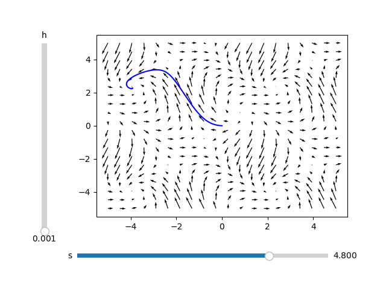
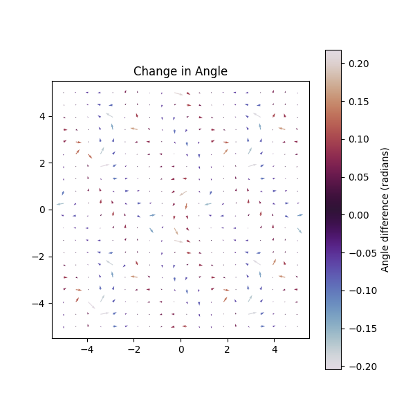

Almost every ODEs instructor, including myself, has dreaded teaching about Euler's method. The lesson is a rough one — it is highly computational, and it can seem unimportant to students taking the class. In some ways the students are correct. As an applied mathematician, I can attest to the fact that we rarely use Euler's method in practice. It is outdated, unstable for stiff equations, and does not offer the conservative qualities of other geometric integrators.  

However, it is the first, simplest, and often **only** numerical method students encounter, and it serves an important pedagogical purpose for motivating further study in numerical analysis. This blog post highlights some code which can (hopefully) make this lesson better.


---

## A Quick Review of Euler’s Method

Consider a one dimensional ODE  

\[
\frac{dy}{dt}=f(y,t)
\]

with smooth enough data. Via a Taylor expansion at \(t_0\)

\[
 y(t_0+h) = y(t_0) + hy'(t_0) + \frac{h^2}{2}y''(t_0) +O(h^3).
\]

Since \(y'(t) = f(y(t),t),\) setting \(y_0 = y(t_0)\), the forward Euler update rule is  

\[
y_0 = y(t_0), \quad t_n = t_{n-1}+h, \quad y_{n+1} = y_n+hf(y_n,t_n).
\]

Euler's method easily generalizes to higher dimensional parameterized equations. Thanks to this, I created an Euler's method visualizer for parameterized vector fields in two dimensions.  


---

## Example Vector Field

For the examples of this blog post, I will be visualizing the parameterized vector field  

\[
   \sin(x+y+s) \frac{\partial }{\partial x} + \left(\cos(x-s)+\sin\left( y\right) \right)\frac{\partial }{\partial y} 
   \tag{1}
\]

with parameter \(s\). The initial condition is \((x_0,y_0) = (0,0)\).  

Notice the difference between the two figures above: the vector field is the same, but the solutions diverge depending on the step size \(h\). This shows the sensitivity of Euler’s method to step size, especially near saddle points.  

---

## Parameter Sensitivity

Suppose we take \(s=4.8\) instead of \(s=4.9\):



Although the vector fields are nearly identical, the fixed points of the approximated solutions are drastically different. This shows how small perturbations in a vector field can lead to large differences in the solution of an ODE.  

We can quantify this by looking at the difference in vector magnitudes:  


The maximum change is about 0.14, and the minimum change is about 0.02. Even these small differences affect the solution trajectory.  

Since the system is autonomous, only vector **angles** matter. Here’s how the angle difference looks:  



The maximum change in angle is around 0.2 radians — small, but significant enough to introduce instability in practice.

---

## Open Questions

- How can we improve upon Euler's method?  
- How should one deal with an unstable system?  
- Given a parameterized vector field, can we analyze its variation over a whole domain?  

These questions connect to broader areas of numerical analysis and dynamical systems. I might expand on them in a future post. Until then, enjoy the vector field visualizer!  

👉 The GitHub repository is [here](https://github.com/erikwendtmath/Computational_Programs).

<!-- [Hugo Blox Builder](https://hugoblox.com) is designed to give technical content creators a seamless experience. You can focus on the content and the Hugo Blox Builder which this template is built upon handles the rest.

**Embed videos, podcasts, code, LaTeX math, and even test students!**

On this page, you'll find some examples of the types of technical content that can be rendered with Hugo Blox.

## Video

Teach your course by sharing videos with your students. Choose from one of the following approaches:



**Youtube**:

    

**Bilibili**:

    

**Video file**

Videos may be added to a page by either placing them in your `assets/media/` media library or in your [page's folder](https://gohugo.io/content-management/page-bundles/), and then embedding them with the _video_ shortcode:

    

## Podcast

You can add a podcast or music to a page by placing the MP3 file in the page's folder or the media library folder and then embedding the audio on your page with the _audio_ shortcode:

    

Try it out:



## Test students

Provide a simple yet fun self-assessment by revealing the solutions to challenges with the `spoiler` shortcode:

```markdown

You found me!

```

renders as

 You found me 🎉 

## Math

Hugo Blox Builder supports a Markdown extension for $\LaTeX$ math. You can enable this feature by toggling the `math` option in your `config/_default/params.yaml` file.

To render _inline_ or _block_ math, wrap your LaTeX math with `$...$` or `$$...$$`, respectively.

{}
We wrap the LaTeX math in the Hugo Blox _math_ shortcode to prevent Hugo rendering our math as Markdown.
{}

Example **math block**:

```latex

$$
\gamma_{n} = \frac{ \left | \left (\mathbf x_{n} - \mathbf x_{n-1} \right )^T \left [\nabla F (\mathbf x_{n}) - \nabla F (\mathbf x_{n-1}) \right ] \right |}{\left \|\nabla F(\mathbf{x}_{n}) - \nabla F(\mathbf{x}_{n-1}) \right \|^2}
$$

```

renders as


$$\gamma_{n} = \frac{ \left | \left (\mathbf x_{n} - \mathbf x_{n-1} \right )^T \left [\nabla F (\mathbf x_{n}) - \nabla F (\mathbf x_{n-1}) \right ] \right |}{\left \|\nabla F(\mathbf{x}_{n}) - \nabla F(\mathbf{x}_{n-1}) \right \|^2}$$


Example **inline math** `$\nabla F(\mathbf{x}_{n})$` renders as $\nabla F(\mathbf{x}_{n})$.

Example **multi-line math** using the math linebreak (`\\`):

```latex

$$f(k;p_{0}^{*}) = \begin{cases}p_{0}^{*} & \text{if }k=1, \\
1-p_{0}^{*} & \text{if }k=0.\end{cases}$$

```

renders as



$$
f(k;p_{0}^{*}) = \begin{cases}p_{0}^{*} & \text{if }k=1, \\
1-p_{0}^{*} & \text{if }k=0.\end{cases}
$$



## Code

Hugo Blox Builder utilises Hugo's Markdown extension for highlighting code syntax. The code theme can be selected in the `config/_default/params.yaml` file.


    ```python
    import pandas as pd
    data = pd.read_csv("data.csv")
    data.head()
    ```

renders as

```python
import pandas as pd
data = pd.read_csv("data.csv")
data.head()
```

## Inline Images

```go
 Python
```

renders as

 Python

## Did you find this page helpful? Consider sharing it 🙌 -->
